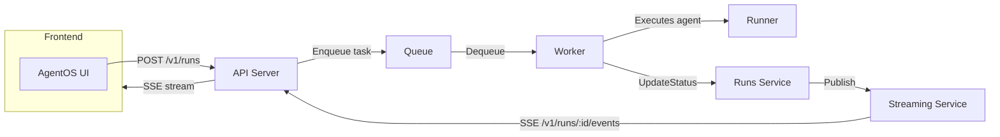

# AgentOS — Backend Overview

This document describes the AgentOS backend (AI-Agentic-Infrastructure-Platform), the runtime flow for agent runs, and local developer steps.

**Purpose**
- Provide an API to manage agents and runs
- Provide a worker process to execute agent runs asynchronously
- Offer a streaming endpoint for run events (SSE)
- Store run metadata in-memory (replaceable with DB)

**Stack**
- Go (net/http)
- In-memory queue + optional Redis implementation
- Streaming service (in-memory pub/sub)

**Key Components**
- `cmd/api` — HTTP API server
  - `/v1/agents` — agent CRUD
  - `/v1/runs` — create runs
  - `/v1/runs/:id` — get run
  - `/v1/runs/:id/events` — GET: history (JSON) or SSE stream; POST: accept external events
- `cmd/worker` — worker process that dequeues tasks and runs agents
- `internal/runs` — runs service (Create/Get/UpdateStatus) with optional streamer integration
- `internal/streaming` — in-memory event pub/sub and history

**Runtime Flow**



Notes:
- The `worker` currently POSTs event payloads to `/v1/runs/:id/events` (so the API streaming service will receive them).
- The `runs` service calls `streamer.Publish` when `UpdateStatus` is invoked, so event history is recorded and subscribers receive live updates.

**Environment / Run locally**

- API server (defaults to port in config):

```bash
# from repo root
go run ./cmd/api
```

- Worker:

```bash
# optionally set AGENTOS_API to point to API (defaults to http://localhost:8080)
export AGENTOS_API=http://localhost:8080
go run ./cmd/worker
```

- Notes on env:
  - `AGENTOS_API` — base URL the worker uses when posting events back to API (default: `http://localhost:8080`)

**How to observe runs**
- Create a run via API (or via the frontend): POST `/v1/runs` with JSON body {"agent_id":"...","input":"..."}
- Open SSE stream: GET `/v1/runs/:id/events` with `Accept: text/event-stream` to receive existing history and live updates.

**Next improvements**
- Persist runs in PostgreSQL (migrations present in `migrations/`), swap runs service to DB-backed implementation.
- Add retries and authentication for worker -> API event POSTs.
- Harden SSE and add token-based authorization for event streams.

---
Generated README with flow diagram (Mermaid) for quick reference.
