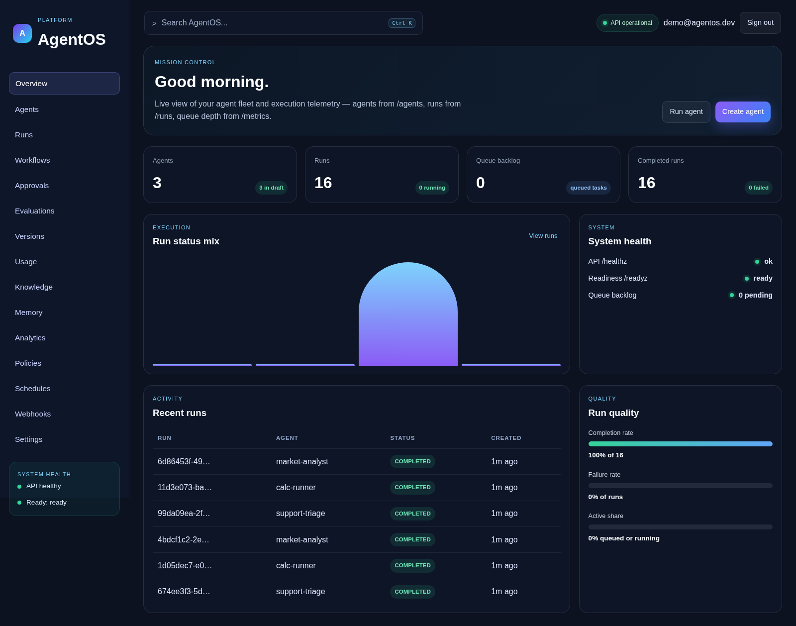
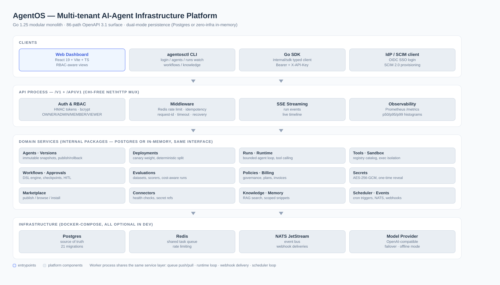
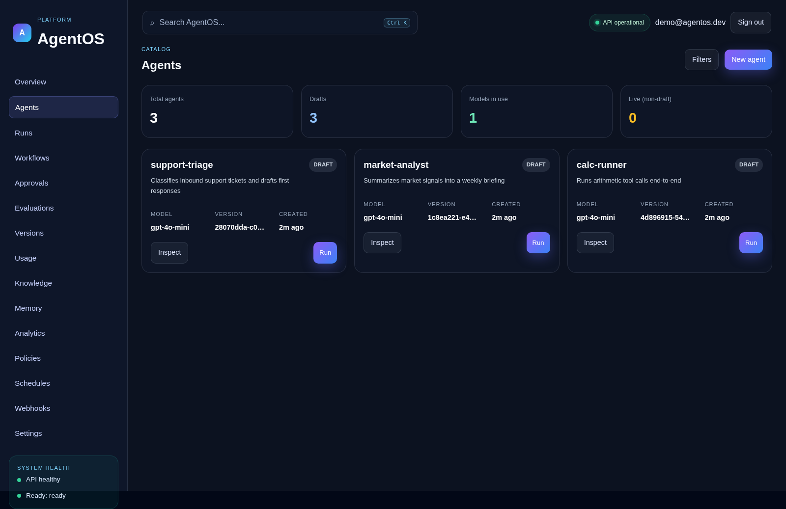
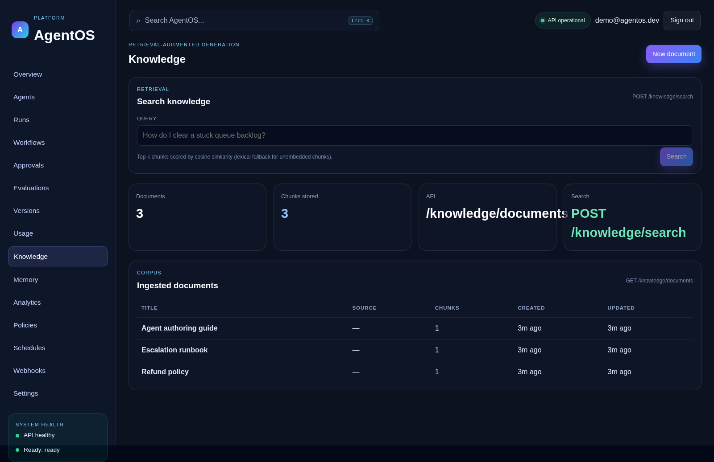
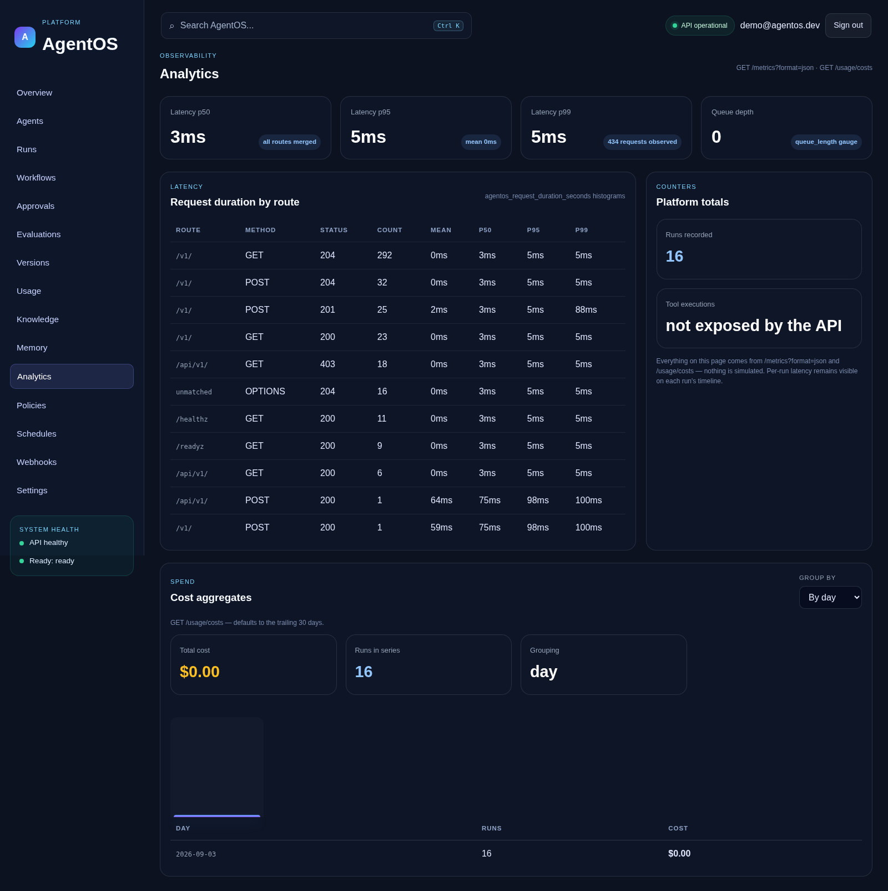
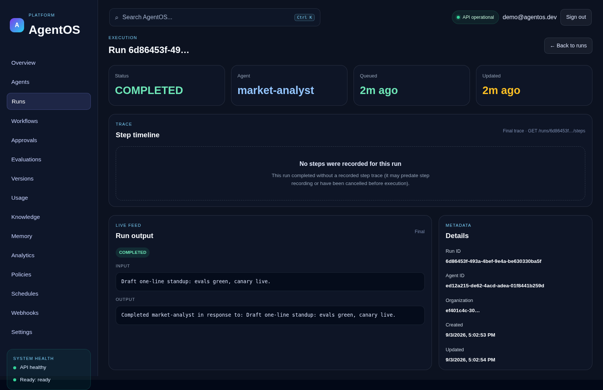

<div align="center">

# AgentOS

**A multi-tenant AI-agent infrastructure platform — built in Go, operated like a product.**

[](https://github.com/Roy-Wanyoike/AI-Agentic-Infrastructure-Platform/actions/workflows/ci.yml)


[](./LICENSE)

**Author agents → version them → deploy with canary traffic splits → run on a durable queue → evaluate, govern, observe, and bill for every token.**

</div>

---

AgentOS is the control plane for running AI agents in production: a Go 1.25 modular monolith (39 internal packages, one deployable API process + one worker) with a React 19 dashboard, an 86-path OpenAPI 3.1 contract, and **dual-mode persistence** — the exact same binary runs against Postgres for production or fully in-memory with zero infrastructure for development and CI. Every tenant boundary, permission check, and retry path is enforced in code and exercised by tests, not promised in docs.



## What's inside

| Area | Capabilities |
|---|---|
| **Agents & versions** | Agent CRUD, immutable config versions, publish/rollback, per-agent tool attachments |
| **Deployments** | Promote/rollback **plus canary deployments** — weighted traffic split with deterministic per-agent stickiness (FNV-1a bucketing) |
| **Runs & runtime** | Bounded agent loop (max steps, wall-clock + per-tool timeouts, loop detection), OpenAI-compatible **model provider with failover**, offline deterministic mode for zero-infra dev |
| **Tools & sandbox** | Tool registry with input schemas (`GET /v1/tools`), calculator + HTTP tools, opt-in **process-isolated sandbox execution** (rlimits, output caps, env scrubbing) |
| **Workflows & approvals** | JSON-DSL multi-agent workflows, durable checkpointed node execution with recovery/watchdog, human-in-the-loop approval gates |
| **Evaluations** | Datasets, scorers, eval runs with per-case **token usage & cost** via a model-pricing hook |
| **Governance** | Policy engine (allow/deny with matched-policy reporting), Redis rate limiting, idempotency keys, org-scoped audit trail (`/v1/audit-events`) |
| **Billing & secrets** | Plans, subscriptions, quota checks, usage-derived invoices reconciled with the runs cost ledger; **AES-256-GCM encrypted secrets** with one-time reveal |
| **Marketplace & connectors** | Publish/browse/install agent templates across organizations; external integrations with health checks and secret refs |
| **SSO & SCIM** | OIDC browser login (manual JOSE, RS256 via stdlib) with JIT provisioning; **SCIM 2.0** user lifecycle with hashed provisioning tokens |
| **Knowledge & memory** | RAG document store with chunking + semantic search, scoped agent memory snippets |
| **Events & scheduling** | NATS JetStream event bus, webhook deliveries with retries, cron scheduler with catch-up |
| **Observability** | Prometheus text `/metrics` (bucketed p50/p95/p99 histograms, run/tool counters), structured logging, health/readiness probes, SSE run-event streaming |
| **Developer experience** | `agentosctl` CLI + typed Go SDK (`internal/sdk`), seeded demo data, Makefile targets, GitHub Actions CI with gofmt/vet/test/build + web build gates |

## Architecture

Dual-mode by design: in Postgres mode every service persists through a tenant-guarded store; in memory mode the same interfaces run on maps — which is why the full test suite (38 packages) runs in seconds with no containers.



## A tour of the dashboard

| | |
|---|---|
|  |  |
| **Agents** — fleet catalog with models, versions, one-click runs | **Knowledge** — RAG corpus with semantic search |
|  |  |
| **Analytics** — real latency percentiles, run counters, cost aggregates (nothing simulated) | **Run detail** — status, input/output, live SSE event feed |

Every number on the analytics page comes from `/metrics?format=json` and `/usage/costs` — where the API doesn't expose a metric, the UI says so instead of inventing one.

## Quick start

**Zero infrastructure (in-memory mode):**

```bash
go run ./cmd/api                       # API on :8080
# second terminal
AGENTOS_API_PULL=true AGENTOS_API=http://localhost:8080 \
  AGENTOS_API_KEY=<dev-key-from-api-log> go run ./cmd/worker
# third terminal
cd web && npm install && npm run dev   # dashboard on :5173
```

**Full stack (durable mode):**

```bash
cp .env.example .env
make docker-up      # Postgres, Redis, NATS
make migrate-up     # apply the 20 migrations
make seed           # demo org + agents + workflow + runs
make run-api        # API on :8080
make run-worker     # run execution (second terminal)
```

Demo login: `demo@agentos.dev` / `demo-password` (override with `AGENTOS_SEED_PASSWORD`).

The API mounts every route twice — `/v1/...` (legacy) and `/api/v1/...` (canonical, used by the dashboard) — from one contract: [`api/openapi.yaml`](api/openapi.yaml).

## Talk to the API

```bash
TOKEN=$(curl -s -X POST localhost:8080/v1/auth/login \
  -H 'Content-Type: application/json' \
  -d '{"email":"demo@agentos.dev","password":"demo-password"}' | jq -r .token)

# create an agent
curl -s -X POST localhost:8080/v1/agents/create \
  -H "Authorization: Bearer $TOKEN" -H 'Content-Type: application/json' \
  -d '{"name":"support-triage","model":"gpt-4o-mini","description":"Classify tickets","instructions":"Classify urgency, draft a reply."}'

# run it (queued → picked up by the worker → step trace + cost)
curl -s -X POST localhost:8080/v1/runs \
  -H "Authorization: Bearer $TOKEN" -H 'Content-Type: application/json' \
  -d '{"agent_id":"<agent-id>","input":"Ticket #4830: password reset loop"}'

# canary: route 20% of a fleet to the new version
curl -s -X POST localhost:8080/v1/deployments/<id>/canary \
  -H "Authorization: Bearer $TOKEN" -H 'Content-Type: application/json' \
  -d '{"canary_version":"<version-id>","canary_weight":20}'
```

**CLI and SDK:**

```bash
go build -o agentosctl ./cmd/agentosctl
./agentosctl login --email demo@agentos.dev
./agentosctl agents list
./agentosctl runs watch <run-id>        # live step stream until terminal
```

```go
client := sdk.New("http://localhost:8080", sdk.WithAPIKey(key))
agents, _ := client.Agents().List(ctx)
run, _ := client.Runs().Create(ctx, agentID, "classify this ticket")
```

## Engineering discipline

- **Contract-first**: the 86-path OpenAPI 3.1 spec is regression-tested by `internal/apispec` — a dangling `$ref`, duplicate `operationId`, or path without operations fails CI (mutation-verified).
- **Tenant isolation everywhere**: every Postgres query carries an `organization_id` guard; tenant identity comes from signed claims, never from client payloads.
- **Security by default**: bcrypt passwords, HMAC-signed session tokens, hashed API keys and SCIM tokens, AES-256-GCM secrets at rest with key-versioned envelopes, OWNER-gated one-time secret reveal (audit-logged).
- **Honest observability**: metrics are incremented at the point of truth (run terminal transitions, tool executions); the dashboard renders "not exposed by the API" rather than fake numbers — no silent mocking, as a product rule.
- **Verified before merged**: every feature landed through a PR gated on `gofmt`, `go vet`, `go build`, and the full `go test -count=1 ./...` suite (38 packages, race-clean on the concurrency-sensitive ones).

```bash
make lint && make verify    # gofmt + vet + build + test
```

## Project structure

```text
├── api/openapi.yaml          # canonical OpenAPI 3.1 contract (86 paths)
├── api/fragments/            # per-track spec fragments, merged into the main spec
├── cmd/
│   ├── api/                  # HTTP process: routes, handlers, middleware wiring
│   ├── worker/               # run execution, scheduler loop, webhook delivery
│   ├── agentosctl/           # CLI
│   ├── seed/                 # idempotent demo seeder
│   └── migrate/              # migration runner
├── internal/                 # 39 domain packages — agents, deployments, runs,
│   │                         # runtime, workflows, evaluations, policies, billing,
│   │                         # secrets, marketplace, connectors, sso, scim, sandbox,
│   │                         # knowledge, memory, events, scheduler, observability …
├── migrations/               # 20 tenant-guarded SQL migrations
├── web/                      # React 19 + Vite + TypeScript dashboard
├── docs/architecture.md      # factual architecture walkthrough
└── docker-compose.yml        # Postgres + Redis + NATS
```

## Docs

- [Architecture walkthrough](docs/architecture.md)
- [OpenAPI contract](api/openapi.yaml) — import into Swagger UI / Postman
- [Implementation plan](docs/agentos-implementation-plan.md)
- [Contributing](CONTRIBUTING.md) — setup, quality gates, PR rules
- [Security policy](SECURITY.md) — private disclosure and SLAs

## License

Apache-2.0 — see [LICENSE](LICENSE).

## Built in the open

AgentOS is developed with a multi-agent workflow: a contract is pinned first (endpoints, JSON shapes, RBAC, migration numbers, file ownership), specialized agents implement disjoint tracks in parallel, and every track ships only after the full verification gate — then lands through a PR that references the issue it closes. The repository history reads as the audit log of that process: wave by wave, from persistence to canary deployments to SSO.
